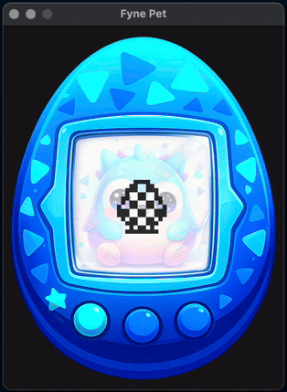

# Fyne Pet

A Tamagotchi inspired pet built using the Fyne toolkit and Go programming language.

## TODO

- [x] Egg animation
- [x] Button to cycle features
- [x] Notifications for attention
- [x] Storage of state and load that on start
- [ ] Implement interactions
- [ ] Implement game
- [ ] Add animations (food, discipline, game)
- [ ] Add food / happy counters and decline
- [ ] Make stats display real
- [ ] Implement age and end of life
- [ ] Set animations per-age
- [ ] Sounds

Also we need to answer the question - should it age when the app is not open...?

## Screenshot

